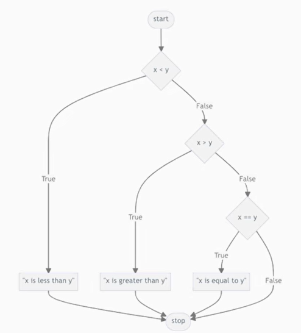

Date: January 22, 2026

# **Conditionals**

symbols you can use in Python, to ask quetions

| > | < = |
| --- | --- |
| > = | == (igualdade) |
| < | ! = (diferença) |

## If

```python
compare.py

x = int (input ("What's x?"))
y = int (input ("What's y?"))

if x < y:
	print ("x is less than y")
if x > y:
    print ("x is greater than y")
if x == y:
    print("x is equal to y")
```

## elif  ( )

Apenas chega a fazer a pergunta se ainda não temos uma resposta obtida das perguntas anteriores. 



## Else (better than elif)

Represents the last one question, so cause logically, is the only condition that wasn’t verified. 

```python
x = int (input ("What's x?"))
y = int (input ("What's y?"))

if x < y:
	print ("x is less than y")
elif x > y:
    print ("x is greater than y")
else:
    print("x is equal to y")
```

## Or

```python
x = int (input ("What's x?"))
y = int (input ("What's y?"))

if x < y or x > y:
    print ("x isn't equal to y")
else:
    print("x is equal to y")
```

## Not Equal (! =)

## And


### Chaining Comparison Operators


- Improvement


## Modulo

In mathematics, parity can refer to whether a number is even(pares) or odd(impares). 

> Remmenbering from the arithmetic symbols, the “%”, represents the modulo operator. OR to calculate the remainder when dividing a number by another.
> 


## Bool

### Defining a new function for is_even


### Pythonic Expressions


or even better 


## Match (CASE)


Usando o match


or 


# Short - Condicionals

```python

def main ():
    difficulty = input ("Dificult or Casual?")
    players = input("Multiplayer or Single-player")
    if difficulty == "Dificult":
       if players == "Multiplayer":
          recommend ("Poker")
       elif players == "Single-player":
            recommend ("Klondike")
       else:
         print("Enter a valid number of players")
    elif difficulty == "Casual":
        if players == "Multiplayer":
           recommend("Hearts")
        elif players == "Single-player":
            recommend ("Clock")
        else: 
            print("Enter a valid number of players") 
    else:
        print ("Enter a valid difficulty") 

def recommend (game):
    print("You might like ", game)

main()
```