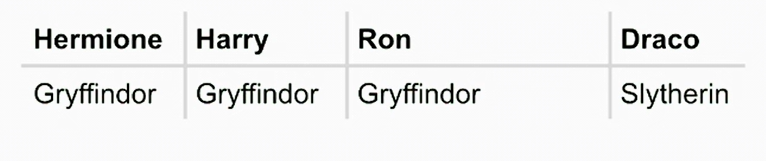

Date: January 22, 2026

# Loops

## While

```python
i = 3 
while i != 0:
    print("meow")
    i = i - 1

```

or an equivalent way to do it

```python

i = 0 # Costuma-se usar o acolumador começando em 
while i < 3:
    print("meow")
    i += 1 

```

## For

### List (type of data)

[x,y,b,a,c]

```python

for i in [1,2,3]: # percorre os valores da lista 
    print ("meow")
```

### Function range

that returns a range of values, according to the argumment that ir recives. 

```python
for i in range(3):
    print ("meow")
```

### Pythonix way to improve that code

```python

for _ in range(3):
    print ("meow")
```

### Other way to do it

```python
print ("meow\n" * 3)

## output 
>> meowmeowmeow

## fixed 
print ("meow\n" * 3, end="")
```

## Validating input

```python

while True:  #infinite loop
    n = int(input("What's n?"))
    if n < 0:
        continue 
    else: 
        break 
        
 ## or 
 while True:  #infinite loop
    n = int(input("What's n?"))
    if n > 0:
         break
         
for _ in range(n):
		print ("meow")
```

### Final cat.meow

```python
def main():
    number = get_number()
    meow(number)

def get_number():
    while True:
        n = int(input("What's n?"))
        if n > 0:
             break 
    return n 
        

def meow(n):
    for _ in range(n):
        print("meow")

main()
```

## Iteration with Lists

### How to print a value from a list

```python
students = ["Hermione", "Harry", "Ron"]

print(students[0])

## output
>> Hermione 
```

___________________________________________________________________

```python
students = ["Hermione", "Harry", "Ron"]

for student in students: 
    print(student)
```

### Function len (length of a list)

```python
students = ["Hermione", "Harry", "Ron"]

for i in range(len(students)): 
    print(i, students [i])
```

## Dictionaries (dict)

Associate a word with something else 



---

sintaxe por dict

```python
students = {
    "Hermione": "Gryffindor",
    "Harry": "Gryffindor",
    "Ron": "Gryffindor",
    "Draco" : "Slytherin"
    }

```

### Using Dict

```python
students = {
    "Hermione": "Gryffindor",
    "Harry": "Gryffindor",
    "Ron": "Gryffindor",
    "Draco" : "Slytherin"
    }

for student in students:
    print(student, students[student], sep=", ")
    
 ##output
Hermione, Gryffindor
Harry, Gryffindor
Ron, Gryffindor
Draco, Slytherin
```

## List of Dictionaries


### Sitaxe dos Dictionaries

```python
students = [
   { "name": "Hermione", "house": "Gryffindor", "patronus": "Otter"},
   { "name": "Harry", "house": "Gryffindor", "patronus": "Stag"},
   {"name": "Ron", "house": "Gryffindor", "patronus": "Jack Russell terrier"},
   { "name": "Draco", "house": "Slytherin",
    "patronus" : None    ## No value
    }
]
for student in students:
    print(student["name"], student["house"], student["patronus"], sep=", ")

```

## Nested Loops (Super Mario Game)

```python
def main():
    print_column(3)
    print_row(4)

def print_column(height):
    print("#\n" * height, end="")

def print_row(widht):
    print("?" * widht)
main()

```

---

```python

def main():
    print_square(3)

def print_square(size):
    # For each row in square
    for i in range(size):
        # for each brick in row
        for j in range(size):
            #print brick
            print("#", end="")
        print() # esse print pula para a linha de baixo depois de terminar o loop, 
                 # basicamente exerce o papel do \n porém ao fim de cada linha 

main()
```

---

```python

def main():
    print_square(3)

def print_square(size):
    for i in range(size):
       print("#"*size)
main()

```

# Short - Dictionaries

```

def main():
    spacecraft = {"name":"Voyager 1", "distance": 163 }
    print(create_report(spacecraft))

def create_report(spacecraft):
    return f"""
    ========== REPORT ==========

    Name: {spacecraft["name"]}
    Distance: {spacecraft["distance"]} 

    ============================
    """

main()

```

## Function .get

```python
def main():
    spacecraft = {"name":"Voyager 1" }
    print(create_report(spacecraft))

def create_report(spacecraft):
    return f"""
    ========== REPORT ==========

    Name: {spacecraft["name"]}
    Distance: {spacecraft.get("distance", "Unknown")} 
    # retira o valor correspondente a "distance",
    # porém se esse não existe entrega "Unknown"
    
    ============================
    """

main()

```

## Adding keys to the dictionare

### Way to add a single key

```python
def main():
    spacecraft = {"name":"Voyager 1" }
# way to add a new key to the dictionare 
    spacecraft["distance"] = 0.01

```

---

### Way to add multiple keys at once

```python

**def main():
    spacecraft = {"name":"Voyager 1" }
    ##
    spacecraft.update({"distance": 0.01, "orbit": "Sun"} )
    print(create_report(spacecraft))**

```

## Function keys

→ **returns to me all the keys in my dictionary.**

Use this when you need the labels or names of the items.

```python

distances = {
    "Voyager 1": 163,
    "Voyager 2": 136,
    "Pioneer 10": 80,
    "New Horizons": 58,
    "PIoneer 11": 44
}

def main():
    for name in distances.keys():
        print(f"{name} is {distances[name]} Au from Earth")
        
main()
```

---

## Function values

→ returns a collection of the **data** (the right side of the colon)

Use this when you only care about the numbers or **data** and do not need to know which label they belong to.

```python

distances = {
    "Voyager 1": 163,
    "Voyager 2": 136,
    "Pioneer 10": 80,
    "New Horizons": 58,
    "PIoneer 11": 44
}

def main():
    for distance in distances.values():
        print(f"{distance} AU is {convert(distance)} m")
        
def convert(au):
    return au * 149597870700

main()
```

# Dictionary Methods

Da forma que temos aqui feito, nunca iria ser atualizada o número de words left 

```python
WORDS = {"PAIR": 4, "HAIR": 4, "CHAIR": 5}

def main():
    print("Welcome to Spelling Bee!")
    print("Your letters are: A I P C R H G")

    while len(WORDS) > 0:
        print(f" {len(WORDS)} words left!")
        guess = input("Guess a word: ")

        #TODO: check if guess in dectionary
        if guess in WORDS.keys():
            print(f"Good Job! You scored {WORDS[guess]} points." )
            
   
    print("That's the game!")

main()
```

## Function .pop()

O item desaparece definitivamente do dicionário

```python
WORDS = {"PAIR": 4, "HAIR": 4, "CHAIR": 5}

def main():
    print("Welcome to Spelling Bee!")
    print("Your letters are: A I P C R H G")

    while len(WORDS) > 0:
        print(f" {len(WORDS)} words left!")
        guess = input("Guess a word: ")

        #TODO: check if guess in dectionary
        if guess in WORDS.keys():
            points = WORDS.pop(guess) #######
            print(f"Good Job! You scored {points} points." )

   
    print("That's the game!")

main()
```

Desta forma, com o pop, é removido do dictionary as palavras que já foram acertadas pelo jogador , o que altomaticamente, na próxima vez que for calculado o len do dictionary, será atualizado o nº de palavras que faltam 

## Function . clear()

→ Retira todos os elementos do dictionary

```python
WORDS = {"PAIR": 4, "HAIR": 4, "CHAIR": 5, "GRAPHIC": 7}

def main():
    print("Welcome to Spelling Bee!")
    print("Your letters are: A I P C R H G")

    while len(WORDS) > 0:
        print(f" {len(WORDS)} words left!")
        guess = input("Guess a word: ")

        #TODO: check if guess in dectionary
        if guess == "GRAPHIC":
            WORDS.clear()    ####################
            print("You've won!")
        if guess in WORDS.keys():
            points = WORDS.pop(guess) 
            print(f"Good Job! You scored {points} points." )

   
    print("That's the game!")

main()
```

## Function .items

→ combine the function .keys(), with the function .items()

Using .items() to get both at the same time

for name, distance in distances.items():
print(f"{name} is {distance} AU from Earth")

```python
WORDS = {"PAIR": 4, "HAIR": 4, "CHAIR": 5, "GRAPHIC": 7}

def main():
    print("Welcome to Spelling Bee!")
    print("Your letters are: A I P C R H G")

    for word, points in WORDS.items():  ###############
        print(f"{word} was worth {points} points")
   
main()
```

## Table- compare functions

| **Method** | **Loop Variable Contains** | **Example Result** |
| --- | --- | --- |
| **`.keys()`** | The Labels (Strings) | `"Voyager 1"`, `"Voyager 2"` |
| **`.values()`** | The Data (Numbers/Integers) | `163`, `136` |
| **`.items()`** | **Both** Key and Value (as a pair) | `("Voyager 1", 163)`, `("Voyager 2", 136)` |

# Short - For Loops

## Version without loop

```python
def main():
    print(write_letter("Mario", "Princess Peach"))
    print(write_letter("Luigi", "Princess Peach"))
    print(write_letter("Daisy", "Princess Peach"))
    print(write_letter("Yoshi", "Princess Peach"))

def write_letter(receiver, sender):
    return f"""
    +~~~~~~~~~~~~~~~~~~~~~~~~~~~~~~~~~~~~~~~~~~~~+
       Dear {receiver}, 

       You are cordinally invited to a ball at 
       Peach's Castle this evening, 7:00 PM. 

       Sincerely, 
       {sender}
    +~~~~~~~~~~~~~~~~~~~~~~~~~~~~~~~~~~~~~~~~~~~~+
    """

main()
```

## Using for loop

```python
def main():
    names = ["Mario", "Luigi", "Daisy", "Yoshi"]
    for i in range(len(names)):
        receiver = names[i]
        print(write_letter(receiver, "Princess Peach"))

def write_letter(receiver, sender):
    return f"""
    +~~~~~~~~~~~~~~~~~~~~~~~~~~~~~~~~~~~~~~~~~~~~+
       Dear {receiver}, 

       You are cordinally invited to a ball at 
       Peach's Castle this evening, 7:00 PM. 

       Sincerely, 
       {sender}
    +~~~~~~~~~~~~~~~~~~~~~~~~~~~~~~~~~~~~~~~~~~~~+
    """

main()
```

or even 

```python
def main():
    names = ["Mario", "Luigi", "Daisy", "Yoshi"]
    for name in names:               ############## change here 
        print(write_letter(name, "Princess Peach"))

def write_letter(receiver, sender):
    return f"""
    +~~~~~~~~~~~~~~~~~~~~~~~~~~~~~~~~~~~~~~~~~~~~+
       Dear {receiver}, 

       You are cordinally invited to a ball at 
       Peach's Castle this evening, 7:00 PM. 

       Sincerely, 
       {sender}
    +~~~~~~~~~~~~~~~~~~~~~~~~~~~~~~~~~~~~~~~~~~~~+
    """

main()
```

# Short - Lists

## Function .append()

**add a single item to the end of a list**

If we try to add more than one 


## Function remove()

→ deletes an item from a list based on its **value**, not its position

```python
ships = ["Voyager 1", "Voyager 2", "Pioneer 10", "Voyager 1"]
ships.remove("Voyager 1") 
# Result: ["Voyager 2", "Pioneer 10", "Voyager 1"]
# (Only the first "Voyager 1" was removed)

```

## Function .extend()

→ adds multiple items from an **iterable** (like another list, a tuple, or a set) to the end of your current list

```python
missions = ["Voyager 1"]
new_missions = ["Pioneer 10", "New Horizons"]
missions.extend(new_missions)
# Result: ["Voyager 1", "Pioneer 10", "New Horizons"]

```

## Function .insert()

→ recives two argumments (x, value) where x is the position we want to add the value in an already existent list 

## Function .reverse()

→ é utilizada para **inverter a ordem** dos elementos de uma lista
+ **In-place (No local):** Ela modifica a lista original diretamente. Ela não cria uma lista nova; ela altera a que já existe.

```python
naves = ["Voyager 1", "Voyager 2", "Pioneer 10", "New Horizons"]

naves.reverse()

print(naves)
# Resultado: ['New Horizons', 'Pioneer 10', 'Voyager 2', 'Voyager 1']

```

# Short - **List and Dictionary Comprehensions**

Create a new list with an already existent list 

## List

### Function lower

in this case is used to turn every word in a list to lowercase. 

```python
def main():
    counts = {}
    words = get_words("address.txt")
    lowercase_words = [words.lower() for word in words ] ###

    for word in words:
        if word in counts: 
            counts[word] += 1
        else:
            counts[word] = 1

save_counts(counts)

```

### Filter

for exemple:

```python
def main():
    counts = {}
    words = get_words("address.txt")                   #######
    lowercase_words = [words.lower() for word in words if len(word) > 4 ]

    for word in words:
        if word in counts: 
            counts[word] += 1
        else:
            counts[word] = 1

save_counts(counts)
```

## Dictionary

### Function .count()

→ contar quantas vezes um determinado valor aparece dentro de uma coleção (como uma lista ou uma string.

```python
def main():
    counts = {}
    words = get_words("address.txt")
    lowercase_words = [words.lower() for word in words if len(word) > 4 ]
                         #####
   counts = {word: lowercase_words.count(word) dor word in lowercase_words}

save_counts(counts)
```

# Short - List Methods

> A list method is some function you can use to manipulate **the data inside of your lists.**
> 

Keeping track of the movements already done in the game by the player

```python
def main():
    history = []

    while True:
        action = input("Action: ")
        history.append(action)
        print(history)

main()
```

→  **If action is equal to undo, I want to do something else.**

```python
def main():
    history = []

    while True:
        action = input("Action: ")
        if action == "Undo" :
           undone =  history.pop()
           print(f"Undone: {undone}")
        elif action == "Restart":
             history.clear()
        else:
             history.append(action)
             print(history)

main()
```

# Short - **String Slicing**

```python
def main():
     phone = "617-495-1000"
     print(phone[0:3]) ## or phone[:3]

main()
```

## Index negative

Read the strig from teh rigth to left

```python
def main():
     phone = "617-495-1000"
     print(phone[-4:])

main()
```

# Short- Tuples


## Retirar coordenada do tuplo


# Short - While Loops

função para regar uma planta- Não consegui fazer para testar no VScode, porque ele importa funções de outro ficheiro e não explica 100% de como estão definidas. 

