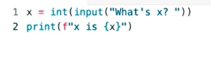

Date: January 23, 2026

# Exceptions

## Syntax Error

Are erros that are entirely on you to solve. 

## Value Error




## Keyword try

If you want to try to do something in Python, you can literally use this keyword, and you can check whether or not something exceptional, something erroneous, has happened. 

```python
try: 
    x = int(input("What's x?"))
    print(f"x is {x}")
except ValueError:
    print("x is not an integer")
```

### NameError

```python
try: 
    x = int(input("What's x?"))

except ValueError:
    print("x is not an integer")

    print(f"x is {x}")
```

"It means that the **portion** of code **to** the right of the equal **sign** isn’t working. So, there is no value **being** associated **with** the variable x."

### Else

```python
try: 
    x = int(input("What's x?"))

except ValueError:
    print("x is not an integer")
else: 
    print(f"x is {x}")
```

### Reprompiting, break

```python
while True:
    try: 
        x = int(input("What's x?"))
        ## or we could simpely have break here
    except ValueError:
        print("x is not an integer")
    else: 
        break

print(f"x is {x}")
```

### Defining new function

```python
def main():
    x = get_int()
    print(f"x is {x}")

def get_int():
    while True:
        try: 
            x = int(input("What's x?"))
					## or we could have return x here
        except ValueError:
            print("x is not an integer")
        else: 
            break
    return x

main()
```

## pass

We don’t return anything in this case, and don´t have do define any reaction, or output, just pass, and keep going 

```python
def main():
    x = get_int()
    print(f"x is {x}")

def get_int():
    while True:
        try: 
            x = int(input("What's x?"))

        except ValueError:
           pass ############
        else: 
            break
    return x

main()
```

## Function Arguments

→ makes the function be more useful

```python
def main():
    x = get_int("What's x? ")
    print(f"x is {x}")

def get_int(prompt):
    while True:
        try: 
            x = int(input(prompt))

        except ValueError:
           pass
        else: 
            break
    return x

main()
```

# Short - Debugging

## Breakpoints

A breakpoint is simply a mechanism when using a text editor or an IDE that allows you to specify on what line or what lines of code do you want to pause or break execution of the program just so you can start poking around at that line of code.

- Tive que instalar :


# Short- **Handling Exceptions**

```python

distances = {
    "Voyager 1": "163",
    "Voyager 2": "136",
    "Pioneer 10": "80 AU",
    "New Horizons": "58",
    "PIoneer 11": "44"
}

def main():
    spacecraft = input("Enter a spacecraft: ")
    m = convert(distances[spacecraft])
    print(f"{m} m away")

    
def convert(au):
    return au * 149597870700

main()
```

Here we have an error, because 

in the dictionary the value of     au usend in the function convert isn’t an int, but, actually an String. So at the and we are printing the au 149597870700 times. 
def convert(au):
    return au * 149597870700

```python
distances = {
    "Voyager 1": "163",
    "Voyager 2": "136",
    "Pioneer 10": "80 AU",
    "New Horizons": "58",
    "PIoneer 11": "44"
}

def main():
    spacecraft = input("Enter a spacecraft: ")
    au = float(distances[spacecraft])
    m = convert(au)
    print(f"{m} m away")

def convert(au):
    return au * 149597870700

main()
```

"But we still have an error **caused** by the '80 AU', **because** it can’t be converted to **a** float **immediately**, **unlike** the rest of the distances."

## ValueError

```

distances = {
    "Voyager 1": "163",
    "Voyager 2": "136",
    "Pioneer 10": "80 AU",
    "New Horizons": "58",
    "PIoneer 11": "44"
}

def main():
    spacecraft = input("Enter a spacecraft: ")
    try: 
        au = float(distances[spacecraft])
    except ValueError:
        print(f" Can't convert {distances[spacecraft]} to a float")
        return ## diz ao Python: "Para tudo e sai da função main() agora mesmo
    
    m = convert(au)
    print(f"{m} m away")

def convert(au):
    return au * 149597870700

main()
```

## KeyError

```python

def main():
    spacecraft = input("Enter a spacecraft: ")
    try: 
        au = float(distances[spacecraft])
    except KeyError: ####################
        print(f"{spacecraft} is not in dictionary")
    except ValueError:
        print(f" Can't convert {distances[spacecraft]} to a float")
        return ## diz ao Python: "Para tudo e sai da função main() agora mesmo
    
    m = convert(au)
    print(f"{m} m away")
```

## Final code

```python

distances = {
    "Voyager 1": "163",
    "Voyager 2": "136",
    "Pioneer 10": "80 AU",
    "New Horizons": "58",
    "PIoneer 11": "44"
}

def main():
    spacecraft = input("Enter a spacecraft: ")
    try: 
        au = float(distances[spacecraft])
    except KeyError:
        print(f"{spacecraft} is not in dictionary")
    except ValueError:
        print(f" Can't convert {distances[spacecraft]} to a float")
        return ## diz ao Python: "Para tudo e sai da função main() agora mesmo
    
    m = convert(au)
    print(f"{m} m away")

def convert(au):
    return au * 149597870700

main()
```

# Short - **Raising Exceptions**

```python
def main():
    pace= get_pace(miles = 26.2, minutes=180)
    print= (f" You need to run each mile in {round(pace, 2)} minutes")

def get_pace(miles, minutes):
    return minutes/miles 

main()
```

But we can’t accept a negative number as a value to the variable minutes, or even 0. 

## Raise

### Exception()

We have the Exeption as a more general error

```python

def get_pace(miles, minutes):
    if not minutes > 0:
        raise Exception()
    return minutes/miles 

```

### ValueError

In this case, we can use **value error to symbolize exactly what kind of error happened.**

```python
def get_pace(miles, minutes):
    if not minutes > 0:
        raise ValueError()
    return minutes/miles 
```

And inside the pharentesses we can give an String that wil be shown to the user when tis exeption is raised. 

```python
def main():
    pace= get_pace(miles = 26.2, minutes=180)
    print(f" You need to run each mile in {round(pace, 2)} minutes")

def get_pace(miles, minutes):
    if not minutes > 0:
        raise ValueError("Invalid value for minutes.")
    return minutes/miles 

main()
```