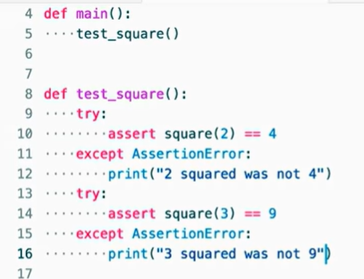

Date: January 24, 2026

# Unit Tests

## Testing [calculator.py](http://calculator.py)

```python
def main():
    x = int(input("What's x? "))
    print (" x squared is", square(x))

def square(n):
    return n * n

if __name__ == "__main__":
    main()
```

## assert (statement - keyword)

that asserts that something is true, 

Se der um erro aparece uma mensagem de erro, e se funcionar e as condições forem verificadas, então não dá nenhum input. 

```python
from calculator import square

def main():
    test_square()

def test_square():
    assert square(2) == 4
    assert square(3) == 9

if __name__ == "__main__":
    main()
    
 no terminal é só colocar:
 para testar a função sem nenhum argumento. 
```

## AssertionError



```python
from calculator import square

def main():
    test_square()

def test_square():
    try:
        assert square(2) == 4
    except AssertionError:
         print("2 squared was not 4")
    try:
        assert square(3) == 9
    except AssertionError:
        print("3 squared was not 9")
    try:
        assert square(-2) == 4
    except AssertionError:
        print("-2 squared was not 4")
    try:
        assert square(0)== 0
    except AssertionError:
        print("0 quared was not 9")

if __name__ == "__main__":
    main()
```

## pip install (TERMINAL)

Nunca costuma funcionar no linux

passo a passo que costuma resolver:

1. usa o comando “which pip” para verificar se o virtial enviroment está ativado 

O resultado deve ser algo como `/home/usuario/Uni/.venv/bin/pip`. Se aparecer `/usr/bin/pip`, a ativação falhou.

2. Se não estiver ativado, segue esse passo a passo:

```
# 1. Apague a pasta atual
rm -rf .venv

# 2. Crie um novo ambiente
python3 -m venv .venv

# 3. Ative o ambiente (MUITO IMPORTANTE)
source .venv/bin/activate

# 4. Tente instalar novamente (SEM usar sudo)
pip install #NOME_DA_LIBRARIE
```

## pip show (TERMINAL)

localiza um determinado ficheiro 

## Pytest

Is a third party program that you can download and install that will automate the testing of your code, so long as you rigth the test. 


```python

def main():
    test_square()

def test_square():
        assert square(2) == 4
        assert square(3) == 9
        assert square(-2) == 4
        assert square(-3) == 9
        assert square(0)== 0

if __name__ == "__main__":
    main()
```

rodar pyteste nome_do_ficheiro


### A good method to use the pytest

dividir o teste em categorias, para ter melhor ideia do que pode está falhando no código em si 

```python
from calculator import square

def main():
    test_positive()
    test_negative()
    test_zero()

def test_positive():
        assert square(2) == 4
        assert square(3) == 9

def test_negative():
        assert square(-2) == 4
        assert square(-3) == 9

def test_zero():
        assert square(0)== 0

if __name__ == "__main__":
    main()
```

## Testing for Exceptions

```python
from calculator import square
import pytest

def main():
    test_positive()
    test_negative()
    test_zero()

def test_positive():
        assert square(2) == 4
        assert square(3) == 9

def test_negative():
        assert square(-2) == 4
        assert square(-3) == 9

def test_zero():
        assert square(0)== 0

def test_str():
      with pytest.raises(TypeError):
            square("cat")
      

if __name__ == "__main__":
    main()
```

### Comando with

comando **`with`** é utilizado para criar o que chamamos de um **Context Manager** (Gestor de Contexto).

No caso específico do teu código de teste, ele serve para "vigiar" a execução do código que está dentro dele.

- **Resultado do Teste:**
- **Se a função `square("cat")` lançar o erro:** O `with` captura o erro e o teste **passa** (fica verde), porque era exatamente isso que estavas à espera.
- **Se a função NÃO lançar erro:** O `with` avisa o `pytest` que algo correu mal, e o teste **falha**, porque tu esperavas um erro e ele não aconteceu.
- **Se a função lançar um erro diferente (ex: `ValueError`):** O teste também **falha**, porque não era aquele o erro esperado.

## Side Effects and Testing

### **Parâmetro por Omissão** (ou *Default Parameter)*

Ele faz duas coisas principais:

**1. Define um Valor Padrão**

Diz ao Python: "Se ninguém me disser para quem enviar o olá, usa a palavra `"world"` por defeito".

**2. Torna o Argumento Opcional**

Isto permite-te chamar a função de duas maneiras diferentes sem dar erro:

- **Sem passar nada:** `hello()`
    - *Resultado:* Imprime `hello, world` (porque ele usa o valor que definiste no `=`).
- **Passando um nome:** `hello("João")`
    - *Resultado:* Imprime `hello, João` (o valor `"João"` substitui o padrão `"world"`).

### Testing with Strigs

our fille [hello.py](http://hello.py) that we want to test

```python
def main():
    name = input("What's your name")
    hello(name)

def hello (to ="word"):
    print("hello," , to)

if __name__ == "__main__":
    main()
```

BUT, since we’re working with Strings, it’s necesary that that function beein tested retur the output, and don’t print it 

So now we have a new version

```python
def main():
    name = input("What's your name")
    print(hello(name))

def hello (to ="world"):
    return f"hello, {to}"

if __name__ == "__main__":
    main()
```

And now the test_hello.py 

```python
from hello import hello

def test_hello(): 
    assert hello() =="hello, world"

def test_argument():
    assert hello("David") == "hello, David"

```

And we can also teste with loops : 


## Collection of Tests

1. mkdir test (cria uma pasta);
2. code teste/test_hello.py (crua um ficheiro dentro da pasta test);
3. define the test_hello.py:
4. inside hello, do code “__init__.py” (that it wil, be empty, but it works to tell Python, that it is a package.  
5. Now we can run pytest not just in the specific folder of tests but the entire folder test. 

# Short pytest

## Function approx()


or : 


**This means that if convert 0.001 returns to me this number** plus or minus 0.1, I'll accept it as being equal to this particular number here.