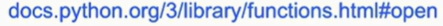

Date: January 24, 2026

# File I/O

Working with files, you can hang on to information long term. 

And File I/O within the context of programming is all about writing code that can read from, thst is load information from, or write to, that is save information to, files themselves. 

## List

É uma boa forma de armazenar mais do que uma informação, porém fica na memória do computador, logo depois de fechar o terminal as informações guardadas anteriormente, são descartadas. 

### Function sorted

Ordena uma lista de Strigs por ordem ALFABETICA 

```python
names = []

for _ in range(3):
    name = input("What's your name? ")
    names.append(name)
    
for name in sorted(names):
    print(f"hello, {name}") 
```

## Function open()

The propose of it is to open a file but to open it programmaticaly. So that you, the programmer, can actually read information from it, or write information to it.

It’s going to allow you to specify exactly what you want read from or write to that file. 



```python
open("names.txt", "w")
```

the “w” says that we want to write on the file. 

```python

name = input("What's your name? ")

file = open("names.txt", "w")
file.write(name)
file.close()
```

Porém esse código só guarda um nome, e depois quando rodamos novamente a [names.py](http://names.py) e adicionamos um novo nome, o anterior desaparece e fica apenas o último nome adicionado. Because, the "w" recria o ficheiro toda vez que o programa roda. 

```python

name = input("What's your name? ")

file = open("names.txt", "a")
file.write(name)
file.close()
```

C«Trocando o “w” pelo “a”, que significa append. 

Porém com o append, os nomes ficam guardados mas juntos um do outro como um único texto 

Solução: 

```python

name = input("What's your name? ")

file = open("names.txt", "a")
file.write(f"{name}\n")
file.close()

```

## with

```python

name = input("What's your name? ")

with open("names.txt", "a") as file: 
    file.write(f"{name}\n")

```

### Reading file

### Função readlines()

vai ler todas as linhas do ficheiro e vai entregar como uma lista. 

```python

with open("names.txt", "r") as file:
    lines = file.readlines()

for line in lines:
    print(line)

```

output:


Fica com esses espaços entre as linhas de espaço, o que resultado da organização dos nomes no ficheiro, como cada nome está em uma linha, a lista que a função readlines cria é a seguinte: ['Jack\n', 'Marcus\n', 'Alfredo\n', 'Maria\n', 'Ana\n']. 

### Function rstrip()

it’s stripping off what is really just an inplematation in the file 

```python

with open("names.txt", "r") as file:
    lines = file.readlines()

for line in lines:
    print(line.rstrip())

```


or we could simply do 

```python
with open("names.txt", "r") as file:
    for line in file:
        print(line.rstrip())
```

### Aplicando o sorted

```python

with open("names.txt") as file:
    for line in file:
        names.append(line.rstrip())

for name in sorted(names): 
    print(f"hello, {name}")       
```

-output 


→ Forma mais compacta 

```python
names = []

with open("names.txt") as file:
    for line in sorted(file):
        print("hello," , line.rstrip())
```

## Comma- Separeted Values (csv)


Create a new file, but now a csv file 


### Function split

If you pass an argument like a comma, what this plit function will do is split that current string into 1, 2, 3, maybe more pieces by looking for that character again and again. 

```python
with open("names.cvs") as file:
    for line in file:
        line.strip().split(",")
```

—> 


or even : 

```
with open("names.csv") as file:
    for line in file:
        name, house = line.strip().split(",")
        print(f"{name} is in {house}")

```

---

```python
students = []

with open("names.csv") as file:
    for line in file:
        name, house = line.rstrip().split(",")
        student = {name: house}
        # students = {"name": name, "house": house}
        # indica que no dictionary haverá uma key chamada "nome" 
        # e que seu value será a variável nome 
        student["name"] = name
        student["house"] = house 
        students.append(student)

for student in students:
    print(f"{student['name']} is in {student['house']}")

```

Why single quotes inside of this f string to access those keys?

Because outside the f string, we’re already using double quotes, if I want to put quotes around any string on the inside, which I do need to do for dictionaries because, you don’t use numbers like lists— you, instead, use strings, wich need to be quoted. 

So, to Python doesn’t ger confused about what lines up with what.  

## Sort Key

### Function sorted

- tem um parametro que podemos especificar qual key que será usado para o sorted.

```python
students = []

with open("names.csv") as file:
    for line in file:
        name, house = line.rstrip().split(",")
        student = {name: house}
        # students = {"name": name, "house": house}
        # indica que no dictionary haverá uma key chamada "nome" 
        # e que seu value será a variável nome 
        student["name"] = name
        student["house"] = house 
        students.append(student)

def get_name(student):
    return student["name"]

for student in sorted(students, key = get_name):
    print(f"{student['name']} is in {student['house']}")
```

In Python, is possible to use a function as an value to a parmeter → 

def get_name(student):
    return student["name"]

for student in sorted(students, key = get_name)

And ther is also this another paramter :

 **for student in sorted(students, key = get_name, reverse = True)**

Where if we use reverse = True, it will sort in the reverse order of the alfabet

## Lambda Functions

- Is an anonymous function that a fuction that just has no name.
- Because you don’t need to give it a name if you’re only going to call in one place.

For exemple, we can replace de fuction get_name with : 

```python

##def get_name(student):
##    return student["name"]

for student in sorted(students, key = lambda student: student["name" ]):
    print(f"{student['name']} is in {student['house']}")
```

### Final code

```python
students = []

with open("names.csv") as file:
    for line in file:
        name, house = line.rstrip().split(",")
        student = {name: house}
        # students = {"name": name, "house": house}
        # indica que no dictionary haverá uma key chamada "nome" 
        # e que seu value será a variável nome 
        student["name"] = name
        student["house"] = house 
        students.append(student)

def get_name(student):
    return student["name"]

for student in sorted(students, key = get_name, reverse = True):
    print(f"{student['name']} is in {student['house']}")

```

## csv libary

ter assim no nomes.txt 

```python
Harry,Number four, Privet Drive
Ron,The Burrow
Draco,Malfoy Manor
```

Vai dar problemas, porque a morada do Harry tem uma vírgula no meio, logo, são muitos argumentos para o split usa a vírgula como parâmetro para separar 

### Function reader()

read a CVS file for you and figure out, where are the commas, where are the quotes, where a all the potential corner cases and just deal with them for you. 


## Function csv.DictReader

is a csv dictionary reader, it can actually treat my CSV file even more flexibly, not just fot this, but other exemples too. 

```python
import csv

students = []

with open("names.csv") as file:
    reader = csv.DictReader(file)
    for row in reader:
        students.append({"name": row['name'], "home": row['home']})

for student in sorted(students, key = lambda student: student["name"]):
    print(f"{student['name']} is from {student['home']}")

```


## Function csv.writer()

```python
import csv

name = input("What's your name? ")
home = input("What's your home? ")

with open("names.csv", "a") as file :
    writer = csv.writer(file)
    writer.writerow([name, home])
```

## Function csv.DictWriter()

```python
import csv

name = input("What's your name? ")
home = input("What's your home? ")

with open("names.csv", "a") as file :
    writer = csv.DictWriter(file, fieldnames= ["name",
```

## Images, PIL library


allows you to navigate image files as well,m and to perform operetions on image files. 

# Short - **Reading and Writing File**

```python
def main():
	with open("alice.txt", "r") as f:
		contents = f.readlines()
		
	## Retitra do ficheiro de texto da linha 53 a 273
	chapter1 = contents[52:272]
	
	main()
```