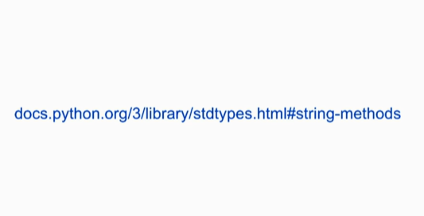

Date: January 21, 2026

[Notes](https://cs50.harvard.edu/python/notes/0/)

> [!tldr]- Notes from the course
> ![[lecture0_notes.pdf]]]

# Functions, Variables

## Parameters

```python
print (*objects, sep=' ' , end='\n', .....
```

end='\n' = every line finish with \n , wich is moving to the next line.  (END = for line ending)

sep=' ' =  just means that when you pass multiple arguments to print, by default they're going to be separated by a single space (SEP = separetor)

And those, are called parameters

and both can be changed and manipulated while programming 

ex : 

```python
name = input ("What's your name?") 
print ("Hello, " , end ="")
print (name)

# output
What's your name?Fer
Hello, Fer

ou 
name = input ("What's your name?")
print ("Hello," , name , sep="aABCD")

#output
What's your name?Fer
Hello,aABCDFer
```

### Colocar uma str entre aspas?

```python
print ("Hello, "friend"") -- NÃO funciona 
Como alternativa, podemos usar essa sitaxe 
print ('Hello, "friend"') 

Ou

print ("Hello, \"friend\"")
```

## **Format string**

```python
print ("Hello," , {name} ) -- doesn't work 

print (f "Hello," , {name} ) # reconhece que name é uma variável 
```

## **Reformat- Manipulate the Users input**



### Whitespace

```python

#Remove whitespace from str
name = name.strip()
```

### Capitalize

```python
#Capitalize user's name + Just the FIRST name 
name = name.capitalize()
```

```python
#Capitalize the first letter of each word 
name = name.title()
```

Nots: we can combine the funcitions strip and title, like this: 

```python
name = name.strip().title()
```

Or even : 

```python
name = input ("What's your name?").strip().title()
```

### Final code

```python
# input ("What's your name?") 

# return values -- variables

name = input ("What's your name?").strip().title()
# print ("Hello, " , name) # Ou print ("Hello, " + name)

# technical term for strings in Python -> str
#  Python's documentation docs.python.org 

print ("Hello," , name )
```

## Ints

| + |  |
| --- | --- |
| - |  |
| * |  |
| / |  |
| % | module operator |

### Interactive mode

```python
#Coloca no terminal python 
# Funciona como o ghci

```

## Calculator

```python
#CALCULATOR

n1 = input ("Digite o primeiro número? ") 
n2 = input ("Digite o primeiro número? ") 

result = int(n1) + int(n2)  # Convet String to int, in this case 

print ("The result is: ", n1 ,"+", n2, "=", result )

# We could do too
result = float(n1) + float(n2)
```

```python
#CALCULATOR

n1 = float (input ("Digite o primeiro número? ") )
n2 = float (input ("Digite o primeiro número? ") )

result = round (n1 + n2) #Arrendonda o resultado 

print (n1 + n2)

```


The [] means is a optional second argument 

In this particular case, we can add ass a secound argument , x , where x is the number of digits that we want to the round function round. 

```python
print (f"{r:,}") # Desta forma o output, sai com vígulas, como: 

fcidrrim@LAPTOP-V8J2B48F:~/Uni/Cs50/Python$ python3 lecture0.py
Digite o primeiro número? 999
Digite o primeiro número? 1
1,000
```

```python
#CALCULATOR

n1 = float (input ("Digite o primeiro número? ") )
n2 = float (input ("Digite o primeiro número? ") )

r = round (n1 /n2), 2 # Arrendonda apenas até as centésimas 

print (f"{r:.2f}") #Specifyhow many digits you want to print 
```

## My own functions

### def = Define

```python
def hello(): 
    print ("hello")
```

or 

```python
def hello(to):  # to is a parameter
    print ("hello," to)

name = input ("What's your name?").strip().title()
hello (name)
```

```python
def hello(to= "world"):  #I'm assigning it with the equal sign a default value of "world,"
    print ("hello," to)

name = input ("What's your name?").strip().title()
hello (name)
```

[Note : In Python, you can´t use a function that is defined afther where you want to use it](Lecture0/Note%20In%20Python,%20you%20can%C2%B4t%20use%20a%20function%20that%20is%20d%202fa1f446d9de81318cdafcfaa2970ad6.md) 

Solucion: 

```python
def main(): # Definir uma função main 
    name = input ("What's your name?").strip().title()
    hello (name)

def hello(to): 
    print ("hello," , to)

main()

```

# Short - Variables

```python

def get_guess():
	guess = int (input("Enter a guess: "))
	return guess
	
def main():
	 guess= get_guess()
	 if guess == 50:
	     print("Correct!")
	 else: 
	     print("Incorrect!")

main()
```

# Short - Return Values

RETURN /= PRINT

```python
def greet(input):
	if "hello" in input: # if "hello" pertence a str do input
			print("hello, there")
	else:
			print("I'm not sure what you mean")
			
greet("hello, computer")
```

DIFERENTE DE USAR RETURN 

```python
def greet(input):
	if "hello" in input: # if "hello" pertence a str do input
			return "hello, there"
	else:
			return "I'm not sure what you mean"
			
greeting= greet("hello, computer")

print (greeting) 
```

# Short - **Side Effects**

```python
emoticon = "v.v" 

def main()
		say("Is anyone there?")
		emoticon = ":D"  #################
		
def say(phrase):
		print (phrase + " " + emoticon)
		
main()
```

A linha sinalizada teria um side effect, porque emoticon está definida fora da função definida, e por isso, podemos acessa-la na função say. Porém, não podemos modifica-la. E, por isso, 

```python
emoticon = "v.v" 

def main()
    global emoticon #### now we're ble now to modify the actual value of that variable as a side effect
		say("Is anyone there?")
		emoticon = ":D"  
		
def say(phrase):
		print (phrase + " " + emoticon)
		
main()
```

# Short- **String Methods**

```python

SHOWS = [
    "  Avatar: the last airbender",
    "Ben 10",
    " Spongebob Squarepants",
    "Phineas and ferb",
    "Kim possible",
    "Jimmy Neutron  ",
    "Jimmy Neutron",
    "the Pround family"
]

def main():
    for show in SHOWS:
        print(show.capitalize().title().strip())

main()
```

```python

SHOWS = [
    "  Avatar: the last airbender",
    "Ben 10",
    " Spongebob Squarepants",
    "Phineas and ferb",
    "Kim possible",
    "Jimmy Neutron  ",
    "Jimmy Neutron",
    "the Pround family"
]

def main():
    cleaned_shows = []
    for show in SHOWS:
        cleaned_shows.append(show.title().strip())
    print(cleaned_shows)

main()
```

A função `.append()` em Python é utilizada para **adicionar um único item ao final de uma lista** existente [1, 3]. Esta função modifica a lista original em vez de criar uma nova [2, 5]. 

---

```python

SHOWS = [
    "  Avatar: the last airbender",
    "Ben 10",
    " Spongebob Squarepants",
    "Phineas and ferb",
    "Kim possible",
    "Jimmy Neutron  ",
    "Jimmy Neutron",
    "the Pround family"
]

def main():
    cleaned_shows = []
    for show in SHOWS:
        cleaned_shows.append(show.title().strip())
    print(' '.join(cleaned_shows))

main()
```

`.join()` é um método de **string**.

—>  join works by specifying first a string you want to use to join your list elements.

**Como funciona a sintaxe:**

`"separador".join(lista)`

**Pontos importantes:**

1. **O separador vem primeiro:** Você chama o método na string que servirá de "cola" (pode ser um espaço `" "`, uma vírgula `","`, uma quebra de linha `"\n"` ou até nada `""`).
2. **Apenas strings:** A lista que você passar para o `.join()` deve conter apenas strings. Se houver números (inteiros), o Python retornará um erro.
3. **Não altera a lista:** O `.join()` cria uma **nova string** e deixa a lista original intacta.

**Comparação rápida:**

- **`.append()`**: Adiciona um item ao final de uma lista (Lista fica maior).
- **`.join()`**: Junta todos os itens de uma lista numa só frase (Cria uma String).